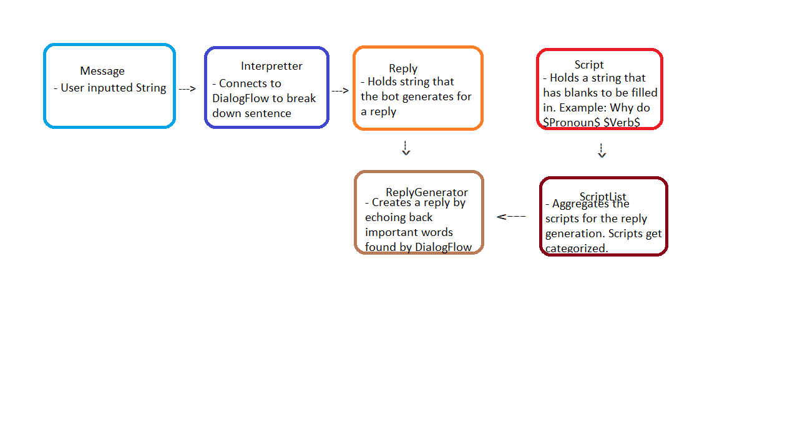

# COSC310 ChatBot Group 19 [Azile - the Psychiatrist Chatbot]
Members: Katrina Martel, Jeff Hatton, Keira Shepherd, Matthew Currie, Brian Su

## What is Azile?
Azile is a psychiatrist bot that is based on the psychiatrist bot "Eliza" created by Joseph Weizenbaum from 1964 to 1966. Azile aims to converse with the user about their day to day and has a focus on helping users with anxiety. Despite Azile's focus on anxiety, it is still suited to help people experiencing different types of emotions. “Eliza”.  It was created as a general chatbot and not a professional help bot for individuals.  It is meant to give assistance dependant on key words entered.

## Motivation:
The application was created as part of COSC 310 Assignment Two.  It will only be maintained during the duration of this course assignment completion.  It is not intended for real world existence.

## Build Status:
 In development. Python code is currently being refactored. The bot does respond to basic input, but needs to be refined and made more robust. Dialogflow is in need of more thorough training.
 
 ## Tech Framework(s) Used:
 - Dialogflow (backend was originally in Java, but had to switch to python for integration)
 - SDLC: Scrum (utilized in the design phase, switched more to XP during development to utilize paired programming)
 
## Class Structure:
During the initial planning phase, we created a class structure; however, we changed our design to focus on the Dialogflow API. We created categories of intents (anxiety, depression, loneliness, school, etc), to which Dialogflow takes in an unstructured user input, searching for keywords (DialogFlow Entities) to match to the categories. To achieve this, training is necessary. Training involves identifying these entities in example inputs. Take, for example, the input, "I am feeling anxious." From this, DialogFlow then identifies the key entities such as "anxious." Then DialogFlow selects a relevant canned response that is used as output, which is displayed on the terminal. 
Everything is housed within Main.py, which integrates the input and canned responses.

Although it was not used in our final implementation, a high-level overview of the original structure can be seen below.


 
## How to interact with Azile:
1. Download the repository files to the local machine.
2. Import the repository into desired python IDE or continue using command-line interfaces of preference (e.g., command prompt).  
3. Install the following dependencies Dialogflow (version 0.5.1) and Google-api-core (version 1.4.1). Via pip run:
```
pip install dialogflow==0.5.1
pip install google-api-core==1.4.1
```
5. To run the bot from the command prompt. After the installation, cd into the directory of the repository, run main.py to start interacting.
```
python main.py
```
6. To run via IDE, `run main.py`.  Users on Pycharm by Jetbrains,  may have to create a new VENV for the specific project after installing the dependencies. Run `main.py` when you want to interact with the bot.


Once the bot is started, Azile will start with some basic input questions to get started with the session.
Follow along with the prompts until the disclaimer is displayed. Then go ahead to chat about anything that the user wishes to talk about with Azile.
Specific phrases, words will prompt individual responses.

## About our code:
In our project, we utilized Dialogflow, a Google-owned developer of human-computer interaction technologies based on Natural Language conversations (WIKI). Within the Dialogflow client, where all API calls are handled, are different intents coded to respond to different inputs. The intents identify emotions and phrases, then in the coded responses, will either prompt the user to elaborate more or provide specific actions for the user to follow. Such as, our bot must advise users to seek professional health support if they express self-harming/ suicidal tendencies. All uncategorizable, and unrecognized inputs will trigger a fall back intent that feeds generic conversation prompts. Our code is within `main.py` that handles the chat interface, an API interaction.

 ## Testing:
 Given the non-deterministic nature of DialogFlow, software testing (such as unit tests) does not serve significant purpose because the test itself will impact the cloud services – further changing how the bot learns to behave.
Given that our intent was to make a bot capable of conversational flow to some degree, our input is infinite. This means 100% test coverage is impossible.

We focused on two components to our conversational flow testing.
1) Will valid input be recognised by the chatbot? Will it receive an intent? Will it be delivered a fitting response from DialogFlow? At this point in development, explicitly including recognized keywords is required.
2) Can our bot handle unexpected user input without crashing? Will it deliver a default response? Can its default response attempt to elicit user input that gravitates back towards recognized topics.

For interaction with dialogflow, Google Assitant was the primary terminal used for user input.

## Credits:
Wikpedia:  https://en.wikipedia.org/wiki/ELIZA
Readme:  https://medium.com/@meakaakka/a-beginners-guide-to-writing-a-kickass-readme-7ac01da88ab3
Testing: https://chatbotsmagazine.com/how-to-test-a-chatbot-part-1-why-is-it-so-hard-10f1ee8ca37d
